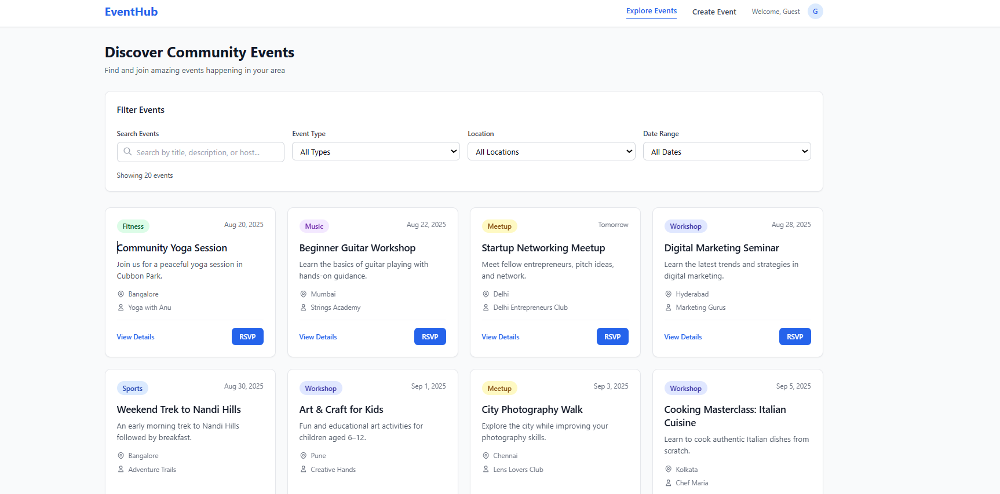

# 🎉 Community Events Discovery Application

A modern, responsive React-based web application for discovering and managing community events. Built with React, TailwindCSS, and Context API for seamless event browsing, filtering, and RSVP functionality.



## ✨ Features

### 🔍 **Event Discovery**
- Browse 20+ community events in a beautiful grid layout
- Advanced filtering by event type, location, and date range
- Real-time search functionality across titles, descriptions, and hosts
- Smart pagination (12 events per page)

### 🎯 **Event Management**
- Detailed event pages with comprehensive information
- RSVP functionality with confirmation pages
- Create new events with form validation
- Event type badges with color coding

### 🎨 **User Experience**
- Desktop-optimized layout (minimum 1440px width)
- Professional UI with smooth transitions and hover effects
- Responsive design with TailwindCSS
- Loading states and error handling

### 🏗️ **Technical Features**
- React 19 with Vite for fast development
- React Router DOM for client-side navigation
- Context API for centralized state management
- Form validation and error handling
- Modern ES6+ JavaScript

## 🚀 Getting Started

### Prerequisites

Make sure you have the following installed on your system:
- **Node.js** (version 16.0 or higher)
- **npm** (comes with Node.js)

### Installation

1. **Clone the repository**
   ```bash
   git clone <repository-url>
   cd community-events-app
   ```

2. **Install dependencies**
   ```bash
   npm install
   ```

3. **Start the development server**
   ```bash
   npm run dev
   ```

4. **Open your browser**
   Navigate to `http://localhost:5173` to view the application

### Build for Production

To create a production build:

```bash
npm run build
```

To preview the production build:

```bash
npm run preview
```

## 📁 Project Structure

```
community-events-app/
├── public/
│   └── vite.svg
├── src/
│   ├── components/
│   │   ├── EventCard.jsx      # Individual event card component
│   │   ├── EventFilters.jsx   # Filtering and search component
│   │   ├── EventList.jsx      # Events grid layout
│   │   ├── Header.jsx         # Navigation header
│   │   ├── Layout.jsx         # Main layout wrapper
│   │   └── Pagination.jsx     # Pagination component
│   ├── context/
│   │   └── EventsContext.jsx  # Global state management
│   ├── data/
│   │   └── events.js          # Sample events data
│   ├── pages/
│   │   ├── CreateEvent.jsx    # Event creation form
│   │   ├── EventDetail.jsx    # Event details page
│   │   ├── Home.jsx           # Main events listing
│   │   └── RSVPConfirmation.jsx # RSVP success page
│   ├── App.jsx                # Main app component
│   ├── index.css              # Global styles with TailwindCSS
│   └── main.jsx               # App entry point
├── index.html
├── package.json
├── tailwind.config.js         # TailwindCSS configuration
├── postcss.config.js          # PostCSS configuration
└── vite.config.js             # Vite configuration
```

## 🛠️ Tech Stack

- **Frontend Framework**: React 19
- **Build Tool**: Vite
- **Routing**: React Router DOM
- **State Management**: Context API
- **Styling**: TailwindCSS
- **Development**: ESLint for code quality

## 🎯 Available Routes

- `/` - Home page with events listing and filters
- `/event/:id` - Individual event details page
- `/create` - Create new event form
- `/rsvp-confirmation/:id` - RSVP confirmation page

## 🎨 Event Types

The application supports various event categories:
- 🏃 **Fitness** - Yoga, meditation, fitness activities
- 🎵 **Music** - Concerts, workshops, performances
- ⚽ **Sports** - Tournaments, outdoor activities
- 🤝 **Meetup** - Networking, social gatherings
- 📚 **Workshop** - Learning, skill development
- 🌟 **Social** - Community service, social causes
- 🎭 **Entertainment** - Comedy, performances, screenings

## 🔧 Configuration

### TailwindCSS
The project uses TailwindCSS v3.4.0 with custom color schemes and utilities. Configuration can be found in `tailwind.config.js`.

### Environment Variables
No environment variables are required for basic functionality. The app uses local state management.

## 🤝 Contributing

1. Fork the repository
2. Create a feature branch (`git checkout -b feature/amazing-feature`)
3. Commit your changes (`git commit -m 'Add amazing feature'`)
4. Push to the branch (`git push origin feature/amazing-feature`)
5. Open a Pull Request

## 📝 License

This project is open source and available under the [MIT License](LICENSE).

## 🙋‍♂️ Support

If you encounter any issues or have questions, please:
1. Check the existing issues in the repository
2. Create a new issue with detailed information
3. Provide steps to reproduce any bugs

---

**Built with ❤️ using React and TailwindCSS By Sanjay Kirti**
